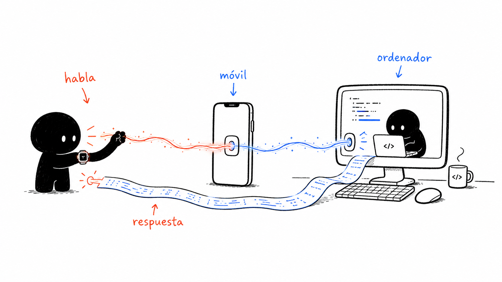
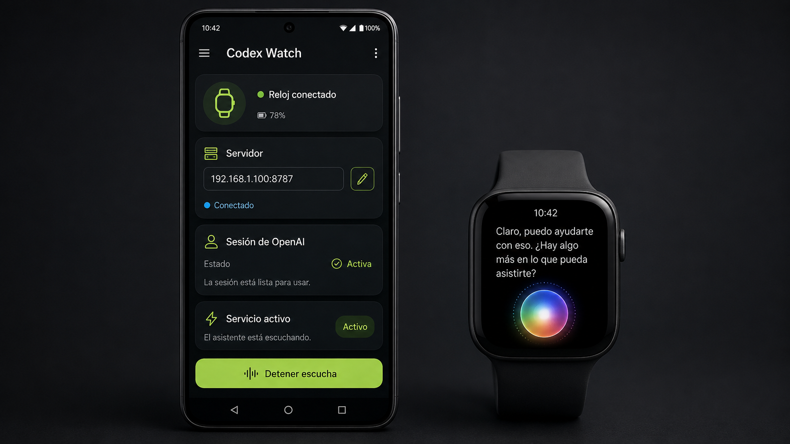
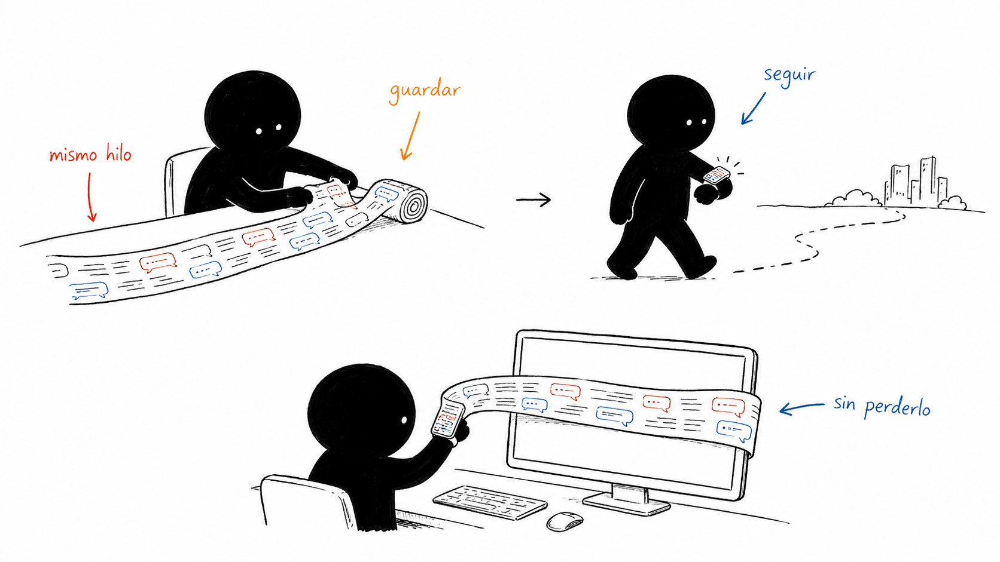
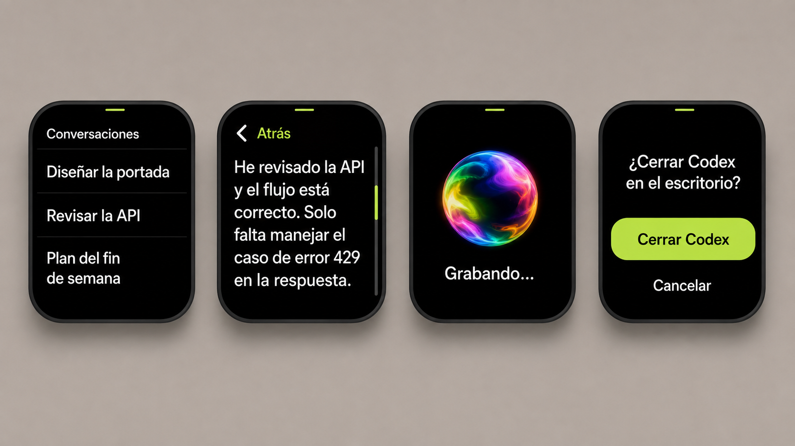

# Codex Watch

### Carry an active Codex task on a tiny ESP32 watch — without pretending the watch is a computer.

Codex Watch turns a touchscreen ESP32 into a small remote window onto the Codex session running on your computer. Browse tasks, read the latest answer, dictate a follow-up, put the device back in your pocket, and return to the same thread later.

> Experimental community project. It is not an official OpenAI product.



## What it feels like

- Your recent Codex tasks appear as a clean list on the watch.
- Opening one shows the latest assistant response in large, scrollable text.
- Pressing the hardware button starts a continuous microphone stream; pressing it again stops.
- The Android companion transcribes the recording with your OpenAI sign-in and forwards the text.
- The desktop bridge sends the message through Codex App Server and returns the response.
- If the display has gone to sleep, a new answer wakes it with a visible pulse animation.
- The watch saves its current screen, task list, response, and scroll position before shutting down, so it can resume optimistically.



## Three small pieces, one continuous experience

| Part | What it does for you |
| --- | --- |
| **ESP32 firmware** | Renders the task list and latest response, streams microphone audio over BLE, shows connection/battery state, sleeps, persists UI state, and restores quickly. |
| **Android companion** | Reconnects to the watch in the background, keeps a foreground-service notification alive, relays data over BLE, signs in to OpenAI, transcribes audio, and talks to the bridge. |
| **Desktop bridge** | Exposes a small local HTTP API, translates watch actions into Codex App Server calls, waits for replies, and handles the desktop-to-watch handoff. |



The ESP32 never runs Codex and never needs direct Internet access. Bluetooth only carries compact UI documents, commands, and raw mono audio between the watch and Android. The phone handles transcription and reaches the computer over whatever private network you choose. The computer remains the place where Codex actually runs.

## The watch interface

The interface is deliberately narrow: task titles, one readable answer, one recording gesture, and one explicit handoff prompt. The colorful orb moves slowly at rest and speeds up while recording. Touch targets are intentionally oversized for a 1.8-inch screen.



## Hardware target

The current firmware targets the **Waveshare ESP32-S3-Touch-AMOLED-1.8** board and uses its:

- 1.8-inch rounded AMOLED touchscreen
- ESP32-S3 Bluetooth Low Energy radio
- on-board microphone and audio codec
- AXP2101 power management and battery telemetry
- BOOT button as the record/stop and wake control

The two locally vendored display components contain small fixes required for stable QSPI/LVGL rendering while BLE audio is streaming. Their upstream licenses are preserved next to their source.

## Try it

### 1. Start the desktop bridge

Requirements: Node.js 20+ and a working `codex` executable with App Server support.

```powershell
cd apps/bridge
npm test
./start-network.ps1
```

The browser test client is available at `http://127.0.0.1:8787`. On Android, enter a private-network address of the same computer, for example `http://192.168.1.100:8787`.

### 2. Build the Android companion

Requirements: JDK 17 and Android SDK 35.

```powershell
./scripts/build-android.ps1
```

Install `apps/android/app/build/outputs/apk/debug/app-debug.apk`, open it once, pair the watch, enter the bridge address, and complete the OpenAI sign-in when you want voice transcription.

### 3. Build and flash the ESP32 firmware

Requirements: Docker, Python, and `esptool`. The build script uses ESP-IDF 5.5.5 in the official Espressif container.

```powershell
./scripts/build-firmware.ps1
./scripts/flash-firmware.ps1 -Port COM5
```

The first command writes a merged image to `artifacts/codex-watch-esp32-merged.bin`. Replace `COM5` with the serial port shown on your computer.

## Handoff behavior

Codex Desktop and the headless App Server can contend for ownership of the same active task. When the watch tries to open a task while the desktop app is running, the bridge returns a confirmation screen. Approving it asks Windows to close Codex Desktop, after which the user opens the task again from the watch. Returning to desktop works in the opposite direction after the bridge releases the task.

## Privacy and security

This repository contains no user tokens, account data, conversation history, device dumps, local paths, machine names, private IP assignments, or compiled firmware/APK artifacts. OpenAI credentials are created at runtime and stored with Android Keystore-backed AES-GCM encryption.

The prototype bridge is **unauthenticated by default**, and the Android companion currently expects that mode. Run it only on a trusted private network; do not port-forward `8787` or expose it directly to the public Internet. See [SECURITY.md](SECURITY.md) before using it outside a local development setup.

The transcription client calls a ChatGPT subscription endpoint used by the signed-in experience. That endpoint is not a stable public API contract and may change. Treat this integration as experimental.

## Repository map

```text
apps/
  android/        Android BLE companion and transcription relay
  bridge/         Node.js HTTP bridge and browser test client
firmware/
  esp32/          ESP-IDF project and the two patched display components
scripts/          Build and flash helpers
assets/           Concept illustrations
docs/images/      Generated product UI mockups
```

## Current scope

This is a working hardware prototype, not a universal smartwatch platform. The BLE service, display geometry, power controller, microphone path, and button mapping are board-specific. Porting it to another ESP32 device means replacing those hardware-facing pieces while keeping the watch document protocol, Android relay, and bridge concepts.
